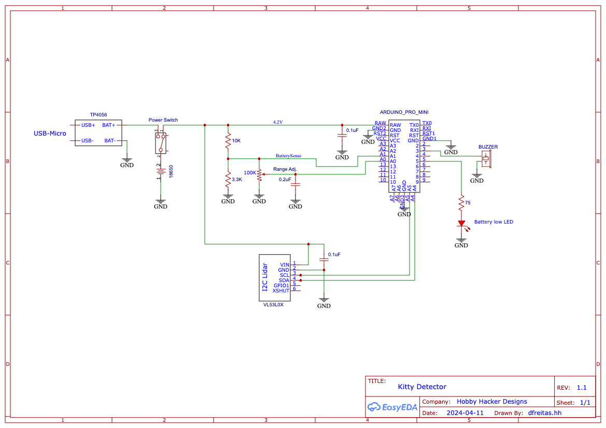

# KittyDetector

* Cat "stay-off-counter" alarm.   Laser range finder detects cat.  One distance zones defined.
If cat gets within the detection zone, then a warning beep sounds.  

* The detection zone is controlled with a potentiometer that will adjust from 0mm to 1023mm. 

* Code uses sleep to power down for one second, then do a quick range check, buzzing alarm if necessary, then back to sleep.
Circuit consumes about 2mA on average.   Runs on one 18650 battery which should be good for about a month.

* When a low battery voltage is detected, the buzzer will chrip once a minute to let you know to re-charge the battery.

## Parts List
- Arduino Pro Mini 3.3v
- VL53L0X laser range finder module ( https://www.amazon.com/gp/product/B08RRT1KJ6/ref=ppx_yo_dt_b_asin_title_o02_s00?ie=UTF8&th=1 )
- 5v continuous sounding Piezo-Buzzer
- 100K potentiometer for range-control
- Common Resistors/Caps/Diodes/Switches
- 18650 battery with 1S BMS module

dlf  3/16/2024

## Schematics

